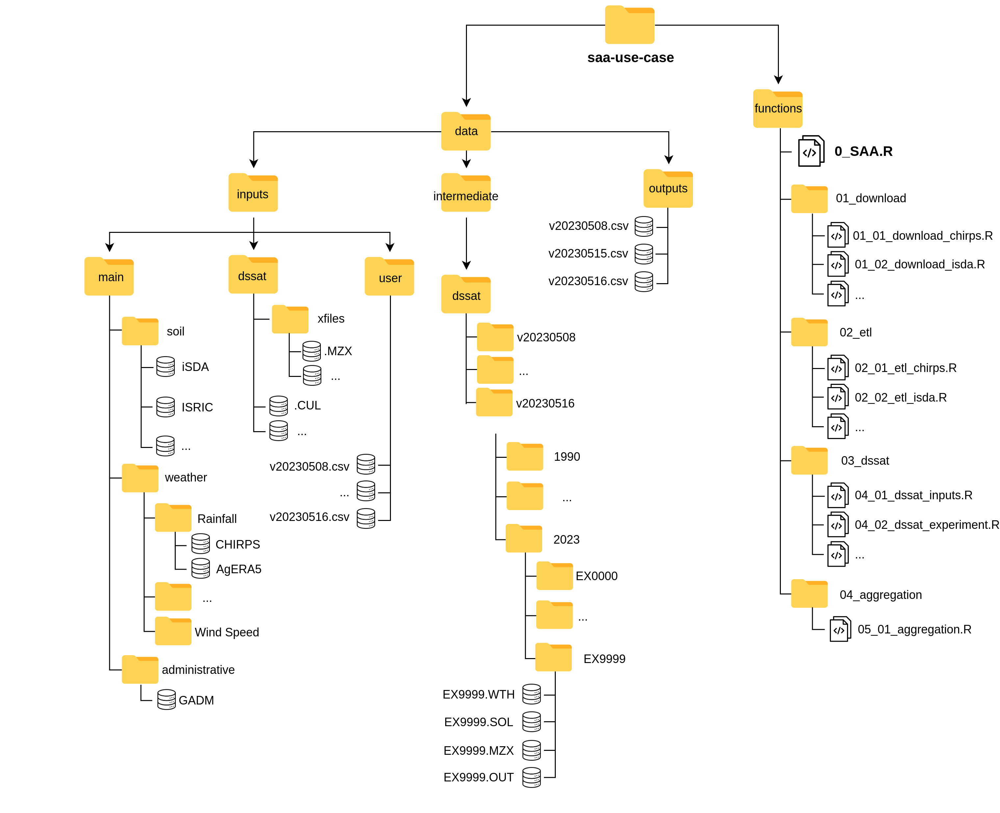
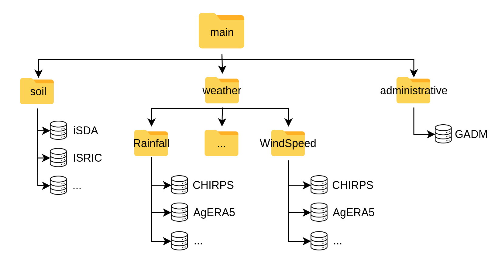
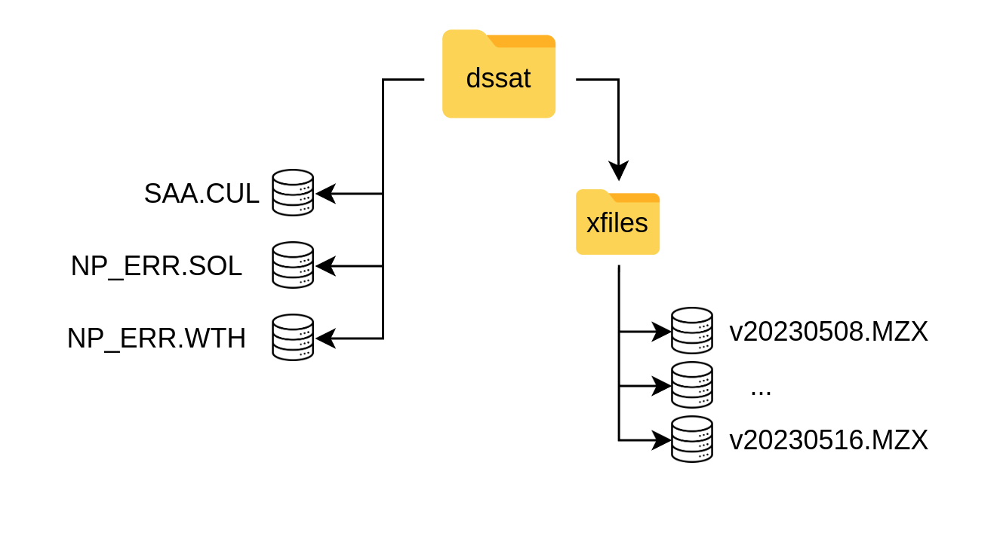
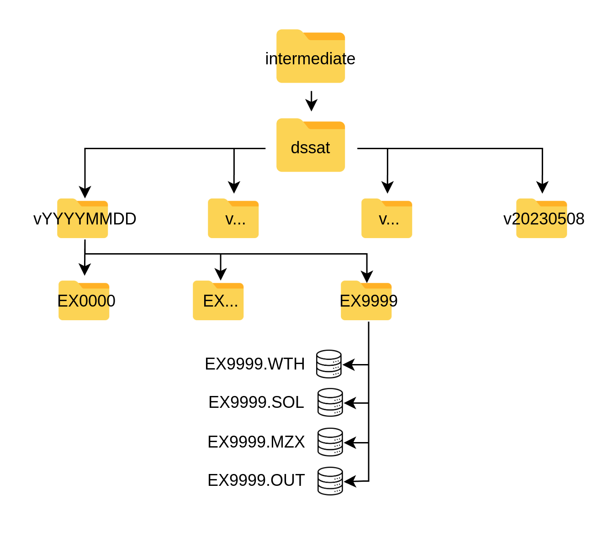

# Data Architecture

Each instance of the Mashawara DST starts from a similar structure of the *root directory*.
This space has a specific architecture to facilitate the management and use of the tool,
and users are encouraged to maintain it or keep it to the extent possible. This design
facilitates the separation between data and processes. Figure 4 describes the architecture
of the system. It is important to observe the clear separation into 2 main sections:
data and functions. The folder “data” is the section where the information should be stored,
and it is described with detail in this entire section. The folder “functions” contains the scripts and
processes running in the DST and it is described in the [functions](functions.html) section.



_Figure 2: Architecture of the SAA DST, containing all the necessary components._

## 1 Inputs

There are data input requirements for the DST to execute, such as environmental information, but also inputs required by DSSAT software,
or others that need to be provided by the user (such as the locations to simulate). This data is stored under `./data/inputs`.
Again, this has three sub-folders with different characteristics.

### 1.1 Main

The first sub-folder is main, and it is mainly referring to spatial or environmental datasets typically stored as `NetCDF` or `GeoTIFF` files.
This directory should be updated using the specific functions to download and source data (see 6.1 Download data).
At this moment main contains 3 sub-folders: soil, weather and administrative, with a README.md describing the contents.
Each of these folders contains available databases. Figure 2 indicates the substructure for this folder.
Unless the user wants to add a specific environmental database, it is better not to add things here.



_Figure 3: main folder under data/inputs containing the spatial and environmental databases._

### 1.2 DSSAT

Another sub-folder is dssat, which stores template format files and input data necessary for DSSAT (figure 7). This includes experimental files (.MZX)
with template management design for the simulations. These management templates need to be kept track in order to know if the DST runs on a different scenario,
and thus the files should be deposited using the labeling convention **vYYYYMMDD.MZX**, where:
- *v*: Indicates a version
- *YYYY*: Indicates the year of the DST execution
- *MM*: Indicates the month of the DST execution
- *DD*: Indicates the day of the DST execution
- *.MZX*: File extension for DSSAT

<center></center>

_Figure 4: The dssat folder with its specific structure containing templates (xfiles, NP_ERR) and the SAA.CUL with the specific varieties part of the DST._

Cultivar files (`vYYYMMDD.CUL`) are DSSAT files containing genotype coefficients for different crop varieties. These are calibrated coefficients for specific locations,
or generic ones. In the `dssat` sub-folder there should be a versioned .CUL file, following the same name convention of `vYYYYMMDD.CUL` which contains the different
coefficients for the varieties used in the DST. Users should add new varieties with the relevant variables (“VAR#”, “VRNAME”, “P1”, etc) to this file.
The DST will only execute the varieties included in this file. It is also important to consider that the tool will execute all varieties included in this file.

```
@VAR#  VRNAME.......... EXPNO   ECO#    P1    P2    P5    G2    G3 PHINT
!                                        1     2     3     4     5     6
IF0012 DT STR W             . IB0001 302.0 0.400 805.9 780.0  6.50 40.00
IF0014 COMP1 SYN NEW        . IB0001 253.3 0.424 794.9 743.3  6.25 38.90
IF0019 EVDT 99              . IB0001 199.5 0.300 789.0 720.4  6.69 40.00
```

### 1.3 User

The **user** folder contains data provided by the user. These could be files containing latitude (Y) and longitude (X) coordinates in decimal degrees and WGS84 (EPSG:4326) SRID.
The first column should refer to the longitude (X) and the second column to latitude (Y). The files should be stored as a (.CSV) with the same labeling convention as the experimental files (.MZX).

## 2 Intermediate

Data produced in the DSSAT component of the DST (component B, [figure 1](overview.html)) are stored under `./data/intermediate` and this only includes one single sub-flder refering
to the different DSSAT executions of the DST and are labeled with the versioning indicated in [1](architecture.html#12-dssat). These are auto-generated sub-directories upon execution of the DST.
These folders contain a series of directories labeled as EX0000, referring to each location (pair of longitude and latitude) for the simulation.
Each of these represents a simulated location and contains those DSSAT files in the specific formats of the software, which include .WTH, .SOL, .MZX and .OUT.
They are generated by the dssat functions (see [DSSAT](functions.html#3-dssat) under [Functions](functions.html)) and the user does not need to interact with them.
The “.OUT” (output files) comprise the crop growth database ([figure 1](overview.html)) and are the inputs for the aggregation functions.

<center></center>

## 3 Outputs

The final outputs of the DST are aggregated results from the DSSAT .OUT crop growth database. These are also auto-generated files following the mentioned naming convention
and are stored in .CSV tabular format under `./data/outputs`. The files contain the final and necessary information for the recommendations:
- **lookup_key**: Location unique identifier
- **var**: Variety recommended
- **pdate**: Planting date to be recommended
- **rank**: for each location the ranking of each variety and planting date recommendation.

