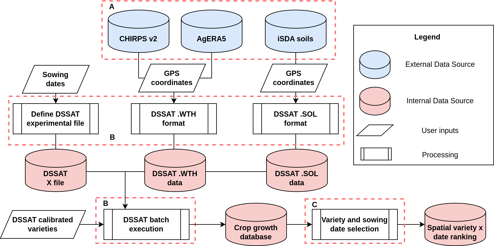

# Overview

Seasonal variability is a major constraint for many farmers under rainfed conditions in many parts of Africa.
Climate change is resulting in more erratic seasonal weather patterns and limiting the ability of farmers to rely on previous
knowledge of the farming system where they operate. The Mashawara (Variety and Planting Window Recommendation) Decision Support Tool (DST)
for EiA aims to provide farmers with spatially explicit recommendations on optimal variety and planting window combinations.
The recommendations are based on DSSAT v47 using a spatialization framework and consuming data from iSDA soil, CHIRPSv2 and
ECMWF AgERA5. Additionally, calibrated cultivar coefficients are used to reproduce the local behavior of cultivar varieties in the target area.
The tool is expected to be updated every cropping season (year), to account for the previous year’s conditions on the recommendations.

In general terms, the DST is composed of 3 main components: inputs, [DSSAT v48](https://dssat.net/) and aggregations.
Figure 1 presents the general overview with the 3 main components as well as the different elements and categories in the system.
These 3 components are sequential, and must be executed in the appropriate order (A, B, C) to produce the expected results.
Component A refers to the data input requirements to execute the process, B is related to the formatting, set-up and execution of
DSSAT and C generates the final outputs with the recommendations. In this DST, external as well as internal data is used along the process,
and only essential data will be persisted in the system. The entire process is publicly accessible on [GitHub](https://github.com/egbendito/mashawarar)
for partners or anyone else.

_Figure 1: General overview of the variety and planting window advice DST. Component A refers to the external data sources for the environmental data.
Component B contains DSSAT related processes. Component C is the final step dealing with the aggregation and formatting of the final data outputs._

In the context of this DST, variety and planting windows are the focus model parameters, and are defined as the values (variety and planting dates)
which maximize the yield, since this is the most important parameter for farmers and the one which determines most agronomic decisions.
This tool therefore provides the final results as a combination of optimal variety and planting times which maximize the yield.
